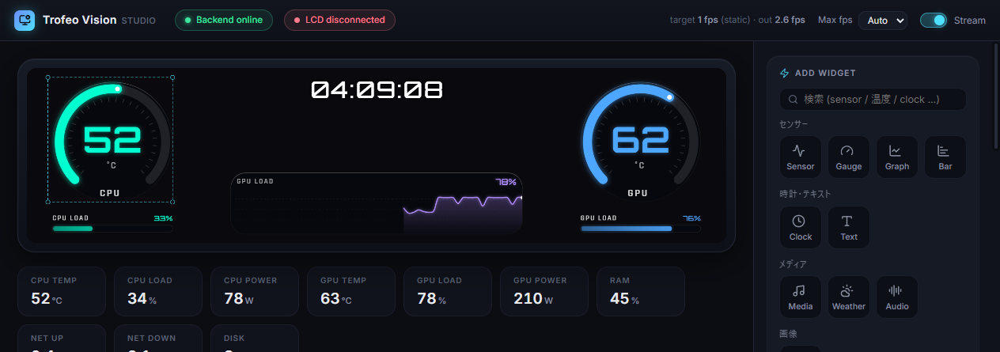
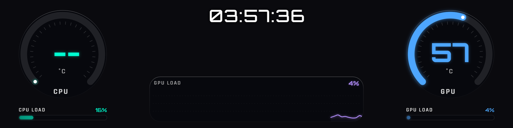

# Trofeo Vision Studio

**Thermalright Trofeo Vision LCD** (USB `0416:5408` / 1920×480) を、純正の
TRCC ソフトを使わずに制御するための **自作ドライバ + ダッシュボードエディタ**
(Windows / Electron + React + Python)。

<p align="center">
  <a href="https://github.com/Nekunegi/TrofeoVisionStudio/releases/latest">
    <strong>Download the latest installer</strong>
  </a>
</p>

<p align="center">
  
</p>

<p align="center">
  <em>LCDに映し出されるフレーム(1920×480):</em>
</p>

<p align="center">
  
</p>

---

## こんな特徴

- **ドラッグ&ドロップ・ダッシュボードエディタ** — 背景・時計・センサー・ゲージ・
  グラフ・バー・メディア・天気・オーディオビジュアライザーを自由配置。
  ドラッグスナップ、undo/redo、キーボード操作、レイヤーパネル完備。
- **ハードウェアセンサー** — CPU/GPU/RAM/ネットワーク/ディスクを
  LibreHardwareMonitor から取得。CPU温度はPawnIO ring0経由。
- **今再生中の曲** — SMTC(System Media Transport Controls)からタイトル・
  アーティスト・進行位置・アートワークを取得。
- **Windows通知のミラー** — フルスクリーンゲーム中でもトースト通知をLCDに表示。
- **オーディオビジュアライザー** — WASAPI ループバックでシステム音声を96バンド
  スペクトラム化(バックエンドで処理→60fps送信)。
- **アニメGIF背景** — IndexedDB永続化、ぼかし・暗さ調整可能。
- **LCD Adjust** — Contrast/Saturation/Brightness補正フィルタ
  (物理輝度はハード側の上限だが、中間トーンにパンチが出る)。
- **テンプレートテキスト** — `{cpu.temp}°C · {gpu.load}%` みたいに1つのテキスト
  ウィジェットにセンサー変数を埋め込める。
- **しきい値ゾーン** — Bar/Graphに warn/crit の色帯を設定。
- **アダプティブfps** — 静的レイアウト時は1fps、通知/センサー変化/音声時に自動でブースト。
- **常駐設計** — トレイに畳んだままログオン自動起動(管理者スケジュールタスク)。
- **自動アップデート** — GitHub Releases から差分ダウンロード → トレイから
  "Install and restart"(セッション中に勝手に再起動はしない)。

## プロトコル解析のクレジット

USB LY-bulk プロトコルの解析は [Lexonight1/thermalright-trcc-linux](https://github.com/Lexonight1/thermalright-trcc-linux)
の成果を参照させてもらいました。本リポジトリはその成果をもとにした
**クリーンルームな Windows / Python 実装**です。

---

## アーキテクチャ

```
  app/  (Electron shell: main.cjs + React/Konva editor)
    │
    │  WebSocket  ws://127.0.0.1:8787
    ▼
  server.py + trofeo/
    ├─ device.py         USB トランスポート(pyusb)
    ├─ protocol.py       LY チャンクプロトコル(ハンドシェイク + フレーム分割送信)
    ├─ sensors.py        センサー取得(LibreHardwareMonitor)
    ├─ audio.py          WASAPI ループバック(オーディオビジュアライザー)
    ├─ media.py          SMTC(再生中メディア)
    ├─ notifications.py  UserNotificationListener(Windows 通知)
    ├─ render.py         PIL 画像 -> JPEG
    └─ dashboard.py      Metrics -> ダッシュボード画像
    │
    │  USB bulk
    ▼
  Trofeo Vision LCD (0416:5408 / 1920×480)
```

フロント(Konva Stage)が編集画面と最終フレーム描画の両方を担い、生成した
JPEG フレームを WebSocket でバックエンドへ送り、バックエンドが USB バルク転送で
LCD に流し込みます。

---

## 通常利用: インストーラー

最新のインストーラーは
[Releases](https://github.com/Nekunegi/TrofeoVisionStudio/releases) から。

初回は **Zadigで `0416:5408` を WinUSB に差し替える**必要があります(下記)。

---

## 開発ビルド

### 必要物(リポジトリにコミットされないバイナリ)

これらは配布ライセンス上の理由で Git 管理外です。手動で配置してください。

- **`libs/`** — [LibreHardwareMonitor](https://github.com/LibreHardwareMonitor/LibreHardwareMonitor)
  **v0.9.6** リリースの DLL 一式(`LibreHardwareMonitorLib.dll` と依存 DLL)を配置。
- **`redist/PawnIO_setup.exe`** — [PawnIO 公式](https://pawnio.eu/) から入手。
  CPU 温度取得に必要。メモリ整合性 / HVCI が有効な環境でも動作します。

### 依存関係

```powershell
pip install -r requirements.txt
cd app; npm install
```

### 3ターミナル起動

```powershell
# ターミナル 1 — バックエンド(CPU 温度も出すなら管理者 PowerShell で)
python server.py

# ターミナル 2 — フロント開発サーバー(Vite)
cd app
npm run dev

# ターミナル 3 — Electron シェル
cd app
npm run electron
```

ヘッダの `Backend online` / `LCD connected` が緑、`target/out fps` が動いていれば
編集内容がそのまま LCD にストリーミングされている状態です。

### リリースビルド

**バックエンドを変更した場合**、PyInstaller で `server.exe` を再生成
(**リポジトリルート**で実行):

```powershell
python -m PyInstaller --noconfirm --onedir --name server `
  --distpath build --workpath build\work --specpath build `
  --collect-all libusb_package --collect-all websockets `
  --collect-all pythonnet --collect-all winsdk --collect-all pyaudiowpatch `
  --hidden-import clr server.py
```

**インストーラー生成** (electron-builder, NSIS, perMachine):

```powershell
cd app
npm run dist   # → app/release/ に NSIS インストーラーが出力される
```

インストーラーは **PawnIO のサイレントインストール**と、**管理者ログオンタスクの
登録**まで自動で行います。

---

## 初回セットアップ(Zadig で WinUSB へ差し替え)

pyusb からデバイスを操作するには、`0416:5408` を **WinUSB** ドライバに
バインドする必要があります。

1. [Zadig](https://zadig.akeo.ie/) を起動
2. **Options → List All Devices**
3. `USBDISPLAY` (`0416:5408`) を選択
4. ドライバに **WinUSB** を選んで **Replace Driver**

> **注意**: この操作で **純正 TRCC は使えなくなります**。元に戻すにはデバイス
> マネージャーで当該デバイスのドライバを削除 → 再接続で純正ドライバが再導入されます。

---

## `tools/`

初回セットアップ・プロトコル検証用のスタンドアロンスクリプト群:

| スクリプト | 用途 |
|-----------|------|
| `demo.py` | ハンドシェイク + 単色(またはテストパターン)フレーム送信のスモークテスト |
| `probe.py` | libusb からデバイス `0416:5408` が見えるか確認(送信なし) |
| `hs_test.py` | ハンドシェイクのみ(表示は変えず双方向通信を確認) |
| `diag.py` | ハンドシェイク応答 / フレーム ACK のダンプ |
| `monitor.py` | 旧・スタンドアロン常駐ドライバ(Studio以前の版) |
| `admin_setup.ps1` | TRCC からの移行用(純正 TRCC プロセス/タスクの停止) |

---

## LY-bulk プロトコル要点(0416:5408)

| 項目 | 値 |
|------|----|
| エンドポイント | OUT `0x09` / IN `0x81` |
| ハンドシェイク | 2048B 送信(`02 FF .. 01 ..`)→ 512B 応答で `[0]=03, [1]=FF, [8]=01` を検証 |
| チャンク | 512B(ヘッダ 16B + ペイロード 496B) |
| バースト | 8 チャンク = 4096B ごとにバルク書き込み、末尾は 2048B |
| 画像形式 | **JPEG** エンコード(LY デバイス仕様) |
| 解像度 | **1920×480** |

詳細は **[docs/PROTOCOL.md](docs/PROTOCOL.md)** を参照 (バイト単位のレイアウト、
バースト構造、エラーリカバリまで解説)。

---

## トラブルシューティング

SmartScreen、Zadig、CPU温度、HVCI/PawnIO、自動起動、ログの場所など
インストール〜運用時の問題は **[docs/TROUBLESHOOTING.md](docs/TROUBLESHOOTING.md)** に
まとめてあります。

---

## 変更履歴

[CHANGELOG.md](CHANGELOG.md) を参照。

---

## Language

- 日本語 — [README.md](README.md) (this file)
- English — [README.en.md](README.en.md)
